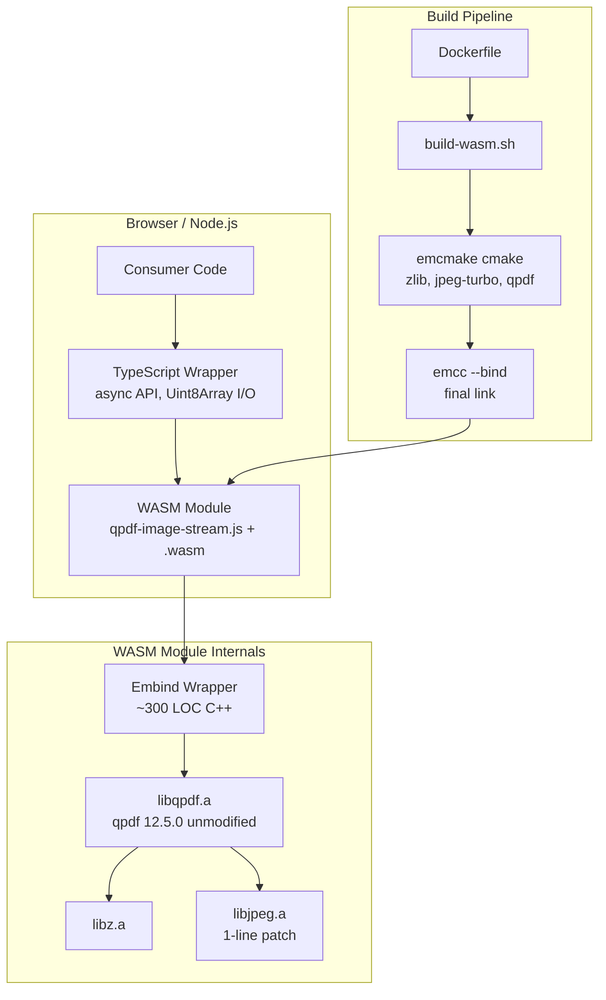

# Design Document: qpdf-wasm-image-streams

## Overview

This design describes a browser-compatible WebAssembly module that exposes qpdf's C++ library API for reading and replacing PDF image streams. The system consists of four layers:

1. **Build Pipeline** – A Docker-based environment that compiles qpdf 12.5.0 and its dependencies (zlib, libjpeg-turbo) to static WASM libraries and links them with a custom Embind wrapper into a single `.wasm` + `.js` ES module.
2. **C++ Embind Wrapper** – A thin (~300 LOC) C++ layer that marshals data between Emscripten's JavaScript bridge and qpdf's public API. It uses `emscripten::typed_memory_view` for output and `emscripten::val` for input to avoid string-encoding binary data.
3. **TypeScript Wrapper** – An async, strongly-typed TypeScript module that handles WASM initialization, Uint8Array↔WASM memory transfers, lifetime management, input validation, and provides an ergonomic public API.
4. **Development Playground** – A minimal static HTML page for manual end-to-end testing during development (excluded from the published package).

### Design Decisions

| Decision | Rationale |
|---|---|
| Custom Embind wrapper instead of CLI (`callMain`) | Existing qpdf-WASM projects only expose CLI; library API access is required for stream manipulation |
| `typed_memory_view` for output, `emscripten::val` for input | Avoids UTF-8 string encoding of binary data; minimizes copies |
| NO_FILESYSTEM=1 | No virtual FS needed – `processMemoryFile` and `setOutputMemory` handle all I/O |
| Docker-based build | Reproducibility across machines; pins Emscripten SDK version |
| ES module output (MODULARIZE=1 + EXPORT_ES6=1) | Modern bundler compatibility; tree-shakeable; works in Workers |
| No Web Worker integration in core module | Keep module simple; consumers can wrap in a Worker as needed |
| Result types instead of exceptions in TS layer | Explicit error handling; no surprise throws from WASM internals |

---

## Architecture



### Data Flow: Image Replacement Workflow

```mermaid
sequenceDiagram
    participant JS as TypeScript Wrapper
    participant W as WASM (Embind Wrapper)
    participant Q as qpdf (libqpdf.a)

    JS->>W: loadPdf(Uint8Array)
    W->>Q: processMemoryFile(ptr, len)
    Q-->>W: QPDF instance ready
    W-->>JS: success result

    JS->>W: getImages(recursive)
    W->>Q: forEachImage(...)
    Q-->>W: ImageInfo[] collected
    W-->>JS: ImageInfo[]

    JS->>W: getImageStreamData(objId, gen)
    W->>Q: getStreamData(qpdf_dl_all)
    Q-->>W: Buffer* (decoded pixels)
    W-->>JS: typed_memory_view → copied to Uint8Array

    JS->>W: replaceImageStream(objId, gen, Uint8Array, metadata)
    W->>Q: replaceStreamData(buffer, filter, parms)
    W->>Q: dict.replaceKey(...)
    Q-->>W: done
    W-->>JS: success result

    JS->>W: writePdf()
    W->>Q: QPDFWriter.setOutputMemory(); write()
    Q-->>W: Buffer* (output PDF)
    W-->>JS: typed_memory_view → copied to Uint8Array

    JS->>W: close()
    W->>Q: delete QPDF instance
    W-->>JS: void
```

---

## Components and Interfaces

### Component 1: Build Pipeline

**Responsibility:** Produce `dist/qpdf-image-stream.js` and `dist/qpdf-image-stream.wasm` from source.

**Structure:**
```
Dockerfile                    # Emscripten SDK + build tools
build-wasm.sh                 # Orchestrates dependency builds + final link
patches/
  jpeg-turbo-emscripten.patch # 1-line BIT_BUF_SIZE fix
deps/
  zlib/                       # Pinned zlib source (tag)
  jpeg-turbo/                 # Pinned libjpeg-turbo source (tag)
qpdf-src/                     # Pinned qpdf 12.5.0 source
```

**Pinned Versions:**
| Dependency | Version | Source |
|---|---|---|
| Emscripten SDK | 3.1.74 | Docker image `emscripten/emsdk:3.1.74` |
| qpdf | 12.5.0 | Tag `v12.5.0` |
| zlib | 1.3.1 | Tag `v1.3.1` |
| libjpeg-turbo | 3.0.4 | Tag `3.0.4` |

**Entry Point:** `docker build -t qpdf-wasm-builder . && docker run --rm -v $(pwd)/dist:/out qpdf-wasm-builder`

**emcc Link Flags:**
```bash
emcc --bind \
  -Os -flto \
  -s WASM_BIGINT=1 \
  -s ALLOW_MEMORY_GROWTH=1 \
  -s NO_DISABLE_EXCEPTION_CATCHING=1 \
  -s MODULARIZE=1 \
  -s EXPORT_ES6=1 \
  -s EXPORT_NAME="createQpdfModule" \
  -s NO_FILESYSTEM=1 \
  -s EXPORTED_RUNTIME_METHODS='[]' \
  -o dist/qpdf-image-stream.js \
  src/wrapper.cpp \
  out/lib/libqpdf.a \
  -I out/include \
  -lz -ljpeg
```

---

### Component 2: C++ Embind Wrapper

**Responsibility:** Marshal data between JavaScript (via Embind) and qpdf's C++ API. No PDF logic lives here.

**Key Design Choices:**
- Use `emscripten::val` to accept `Uint8Array` from JS without string encoding
- Use `emscripten::typed_memory_view` to return binary data as a zero-copy view that the TS layer copies out
- Maintain an internal `std::vector<uint8_t>` buffer for output data to ensure the typed_memory_view remains valid until the next call
- Catch all C++ exceptions at the boundary and return structured results

**Interface (C++ → JS via Embind):**

```cpp
class QpdfWasmWrapper {
public:
    QpdfWasmWrapper();
    
    // PDF lifecycle
    val loadPdf(val uint8Array);                    // Returns {success, error?}
    val loadPdfWithPassword(val uint8Array, std::string password);
    val writePdf();                                  // Returns Uint8Array view
    void close();
    
    // Image enumeration
    val getImages(bool recursive);                  // Returns ImageInfo[]
    
    // Stream I/O
    val getImageStreamData(int objId, int gen);     // Returns Uint8Array view
    val getRawImageStreamData(int objId, int gen);  // Returns Uint8Array view
    
    // Stream replacement
    val replaceImageStream(int objId, int gen, val uint8Array, val metadata);
    
    // Utilities
    int getPageCount();

private:
    std::unique_ptr<QPDF> qpdf_;
    std::vector<uint8_t> outputBuffer_;  // Keeps typed_memory_view valid
    bool closed_ = false;
};
```

**Binary Data Transfer Pattern (Output):**
```cpp
val getImageStreamData(int objId, int gen) {
    auto obj = qpdf_->getObjectByID(objId, gen);
    auto buf = obj.getStreamData(qpdf_dl_all);
    
    // Copy into member buffer so the view stays valid
    outputBuffer_.assign(buf->getBuffer(), buf->getBuffer() + buf->getSize());
    
    return val(typed_memory_view(outputBuffer_.size(), outputBuffer_.data()));
}
```

**Binary Data Transfer Pattern (Input):**
```cpp
val loadPdf(val uint8Array) {
    // Read length and copy from JS heap to C++ heap
    unsigned int length = uint8Array["length"].as<unsigned int>();
    std::vector<uint8_t> data(length);
    
    val memoryView = val::global("Uint8Array").new_(
        val::module_property("HEAPU8")["buffer"],
        reinterpret_cast<uintptr_t>(data.data()),
        length
    );
    memoryView.call<void>("set", uint8Array);
    
    qpdf_->processMemoryFile("input.pdf", 
        reinterpret_cast<char const*>(data.data()), length, nullptr);
    // ...
}
```

---

### Component 3: TypeScript Wrapper

**Responsibility:** Provide an ergonomic, type-safe, async API. Handle WASM initialization, memory copying, input validation, and lifecycle management.

**Public API:**

```typescript
// --- Factory ---
export async function createQpdfImageStreams(
    options?: CreateOptions
): Promise<QpdfImageStreams>;

export interface CreateOptions {
    /** Override WASM file URL for CDN/bundler compatibility */
    locateFile?: (filename: string) => string;
}

// --- Main API ---
export interface QpdfImageStreams {
    loadPdf(data: Uint8Array): Result<PdfDocument>;
    loadPdfWithPassword(data: Uint8Array, password: string): Result<PdfDocument>;
}

export interface PdfDocument {
    getImages(options?: { recursive?: boolean }): Result<ImageInfo[]>;
    getImageStreamData(objId: number, generation: number): Result<Uint8Array>;
    getRawImageStreamData(objId: number, generation: number): Result<Uint8Array>;
    replaceImageStream(
        objId: number,
        generation: number,
        data: Uint8Array,
        metadata?: Partial<ImageMetadata>
    ): Result<void>;
    writePdf(): Result<Uint8Array>;
    close(): void;
}

// --- Supporting Types ---
export interface ImageInfo {
    objId: number;
    generation: number;
    width: number;
    height: number;
    bitsPerComponent: number | null;
    colorSpace: string | null;
    filter: string | null;
    streamLength: number;
}

export interface ImageMetadata {
    width: number;
    height: number;
    bitsPerComponent: number;
    colorSpace: string;
    filter: string;
}

// --- Result Type ---
export type Result<T> = { ok: true; value: T } | { ok: false; error: string };
```

**Key Implementation Details:**

1. **WASM Initialization:** The factory function calls `createQpdfModule()` (the Emscripten-generated loader), awaits the Promise, then wraps the raw Embind API.

2. **Memory Copy on Output:** Every `typed_memory_view` returned from WASM is immediately copied into a new `Uint8Array` via `new Uint8Array(view)` before being returned to the caller. This ensures data remains valid after subsequent WASM calls.

3. **Input Transfer:** Input `Uint8Array` is passed directly to the Embind wrapper via `emscripten::val`, which handles the JS→WASM heap copy.

4. **Lifecycle Guard:** After `close()` is called, a `closed` flag is set. All methods check this flag and return an error result if the instance is disposed.

5. **Input Validation:** The TS wrapper validates:
   - `data` is a `Uint8Array` instance
   - `data.byteLength <= 256 * 1024 * 1024` (256 MB limit)
   - `objId` and `generation` are non-negative integers
   - Metadata values (if provided): width/height > 0, bitsPerComponent > 0

---

### Component 4: Development Playground

**Responsibility:** Minimal browser UI for manual end-to-end testing during development.

**Structure:**
```
playground/
  index.html       # Single-file HTML with embedded JS
```

**Features:**
- File picker / drag-and-drop for PDF input
- Displays image list (table of ImageInfo)
- Button to read/display raw stream data size
- Button to trigger a dummy replacement (e.g., fill with zeros)
- Download button for modified PDF
- Error display area

**Serving:** `npx serve playground/` or any static HTTP server.

---

## Data Models

### ImageInfo (transferred from WASM to JS)

| Field | Type | Description | Nullable |
|---|---|---|---|
| objId | int | PDF object ID | No |
| generation | int | PDF generation number | No |
| width | int | Pixel width from /Width | No |
| height | int | Pixel height from /Height | No |
| bitsPerComponent | int \| null | From /BitsPerComponent | Yes (if missing) |
| colorSpace | string \| null | From /ColorSpace (name or unparsed) | Yes (if missing) |
| filter | string \| null | From /Filter (name or array unparsed) | Yes (if missing) |
| streamLength | int | Raw encoded stream byte length from /Length | No |

### Result<T> (TypeScript discriminated union)

```typescript
// Success case
{ ok: true, value: T }

// Error case  
{ ok: false, error: string }
```

All operations return `Result<T>` instead of throwing. The error string is sourced from:
- qpdf C++ exception `what()` messages
- TypeScript validation messages (e.g., "Instance has been disposed", "Data exceeds 256 MB limit")
- WASM memory errors (e.g., "Insufficient memory for binary data transfer")

### Internal WASM State

```
QpdfWasmWrapper instance
├── qpdf_: unique_ptr<QPDF>          // The loaded PDF document
├── outputBuffer_: vector<uint8_t>   // Holds last output for typed_memory_view validity
└── closed_: bool                     // Lifecycle flag
```

The `outputBuffer_` pattern ensures that `typed_memory_view` pointers remain valid until the caller copies the data. Each output call overwrites the previous buffer.

### Build Artifacts

| Artifact | Path | Description |
|---|---|---|
| WASM binary | `dist/qpdf-image-stream.wasm` | Compiled WebAssembly (~2-3 MB with -Os -flto) |
| JS glue | `dist/qpdf-image-stream.js` | ES module that loads and instantiates WASM |
| TS wrapper | `src/index.ts` | Public API implementation |
| Type declarations | `dist/index.d.ts` | Generated `.d.ts` for consumers |

### npm Package Contents

```json
{
  "name": "@emborado/qpdf-image-streams",
  "type": "module",
  "exports": {
    ".": {
      "types": "./dist/index.d.ts",
      "import": "./dist/index.js"
    }
  },
  "files": [
    "dist/index.js",
    "dist/index.d.ts",
    "dist/qpdf-image-stream.js",
    "dist/qpdf-image-stream.wasm"
  ],
  "engines": {
    "node": ">=18"
  }
}
```

---

## Correctness Properties

*A property is a characteristic or behavior that should hold true across all valid executions of a system — essentially, a formal statement about what the system should do. Properties serve as the bridge between human-readable specifications and machine-verifiable correctness guarantees.*

### Property 1: PDF Load/Write Round Trip

*For any* valid PDF provided as a Uint8Array, loading it into the module and immediately writing it back (without modifications) SHALL produce a PDF that, when reloaded, yields the same image enumeration results (count, object IDs, dimensions, color spaces, filters) as the original.

**Validates: Requirements 6.2, 6.3**

### Property 2: Image Stream Read Round Trip

*For any* Image_XObject in a loaded PDF, reading its decoded stream data and then replacing the stream with the identical data and original metadata SHALL result in a written PDF that, when reloaded, yields the same decoded stream data for that object.

**Validates: Requirements 4.1, 5.1, 6.1**

### Property 3: Stream Replacement Updates Metadata Correctly

*For any* valid replacement data (non-empty Uint8Array) and valid metadata (positive width, positive height, positive bitsPerComponent, non-empty colorSpace), replacing an image stream and then re-enumerating images SHALL show the updated metadata values for that object, with streamLength equal to the byte length of the replacement data.

**Validates: Requirements 5.1, 3.2**

### Property 4: Omitted Metadata Fields Are Preserved

*For any* Image_XObject with existing metadata, replacing the stream with new data but omitting metadata fields (zero for integers, empty string for strings) SHALL preserve the original values for those fields in the resulting PDF (except /Length which always equals the new data size).

**Validates: Requirements 5.2**

### Property 5: Invalid Input Rejection

*For any* byte sequence that is not a valid PDF (random bytes, truncated data, wrong magic bytes), loading it SHALL return an error result (ok: false) and no document handle SHALL be created.

**Validates: Requirements 2.3**

### Property 6: Disposed Instance Rejection

*For any* sequence of operations attempted after `close()` has been called, every method (getImages, getImageStreamData, getRawImageStreamData, replaceImageStream, writePdf) SHALL return an error result indicating the instance has been disposed.

**Validates: Requirements 7.3**

### Property 7: Image Deduplication

*For any* PDF containing the same Image_XObject referenced from multiple pages or Form XObjects, image enumeration SHALL return each unique image (identified by objId + generation) exactly once.

**Validates: Requirements 3.6**

### Property 8: Invalid Metadata Rejection

*For any* replacement call where width is negative, height is negative, or bitsPerComponent is negative, the TypeScript_Wrapper SHALL return an error result without modifying the existing stream.

**Validates: Requirements 5.3**

---

## Error Handling

### Error Boundary Layers

```
Layer 1: qpdf C++ exceptions
  ↓ caught at Embind boundary
Layer 2: Structured result object { success, error }
  ↓ translated by TypeScript wrapper
Layer 3: Result<T> type { ok, value/error }
  ↓ returned to consumer
```

### Error Categories

| Category | Source | Example | TS Result |
|---|---|---|---|
| PDF Parse Error | qpdf exception | "not a PDF file" | `{ ok: false, error: "..." }` |
| Password Error | qpdf exception | "invalid password" | `{ ok: false, error: "..." }` |
| Object Not Found | Embind wrapper | object ID doesn't exist | `{ ok: false, error: "Object not found: ..." }` |
| Filter Decode Error | qpdf exception | unsupported filter | `{ ok: false, error: "..." }` |
| Validation Error | TS wrapper | negative dimensions | `{ ok: false, error: "Invalid metadata: ..." }` |
| Size Limit | TS wrapper | data > 256 MB | `{ ok: false, error: "Data exceeds 256 MB limit" }` |
| Lifecycle Error | TS wrapper | method called after close() | `{ ok: false, error: "Instance has been disposed" }` |
| Memory Error | WASM runtime | allocation failure | `{ ok: false, error: "Insufficient memory..." }` |
| Init Error | Emscripten loader | .wasm fetch fails | Promise rejection with Error |

### Design Rules

1. **No raw throws from the public API** – All operations return `Result<T>`. The only exception is the factory function, which rejects its Promise if WASM loading fails (since no instance exists yet to return a result from).

2. **Error messages propagate from qpdf** – The C++ exception `what()` string is passed through unchanged so developers can search qpdf documentation for the error.

3. **Validation before WASM calls** – The TypeScript layer validates inputs (type checks, size limits, lifecycle state) before crossing into WASM, avoiding unnecessary WASM overhead for obviously invalid calls.

4. **Non-corrupting failures** – A failed `replaceImageStream` does not modify the loaded PDF. The qpdf API either completes the replacement or throws before mutating state.

---

## Testing Strategy

### Dual Testing Approach

This feature is well-suited to property-based testing because:
- The core operations (load, enumerate, read, replace, write) are pure transformations on binary data
- The input space is large (arbitrary PDFs, arbitrary image data, varying metadata)
- Universal properties (round-trips, invariants) can be verified across many generated inputs

### Property-Based Tests

**Library:** [fast-check](https://github.com/dubzzz/fast-check) (TypeScript PBT library)

**Configuration:**
- Minimum 100 iterations per property
- Each test tagged with: `Feature: qpdf-wasm-image-streams, Property {N}: {title}`

**Test Targets (from Correctness Properties):**
1. PDF load/write round trip (Property 1)
2. Image stream read round trip (Property 2)
3. Stream replacement metadata update (Property 3)
4. Omitted metadata preservation (Property 4)
5. Invalid input rejection (Property 5)
6. Disposed instance rejection (Property 6)
7. Image deduplication (Property 7)
8. Invalid metadata rejection (Property 8)

**Generators needed:**
- Valid PDF Uint8Array generator (pre-generated corpus + random modifications)
- Random Uint8Array generator (for stream data)
- Valid ImageMetadata generator (positive ints, non-empty strings)
- Invalid metadata generator (negative values, etc.)

### Unit Tests (Example-Based)

**Framework:** vitest

| Test Area | Examples |
|---|---|
| PDF loading | Valid PDF loads successfully; corrupt file returns error; password-protected with correct/incorrect password |
| Image enumeration | PDF with 0, 1, 5 images; recursive vs non-recursive; deeply nested Form XObjects |
| Stream reading | JPEG-compressed image; Flate-compressed image; uncompressed image; non-existent object ID |
| Stream replacement | Replace with larger data; replace with smaller data; partial metadata update |
| PDF writing | Write unmodified PDF; write after single replacement; write after multiple replacements |
| Memory management | close() then call methods; double close(); large PDF memory usage |
| TypeScript validation | Uint8Array type check; size limit check; negative metadata |
| Factory function | Successful init; locateFile option; failed .wasm fetch |

### Integration Tests

**Environment:** Headless browser (Playwright) + Node.js

| Test Scenario | Verification |
|---|---|
| Full workflow in browser | Load real PDF → enumerate → replace → write → verify output |
| Web Worker compatibility | Module loads and operates inside a Worker |
| Large PDF handling | 50 MB PDF processes without timeout or crash |
| Multiple sequential PDFs | Process 10 PDFs, verify no memory leaks via close() |

### Test Fixtures

Pre-generated PDF test files with known properties:
- `simple-one-image.pdf` – Single uncompressed RGB image
- `multi-image.pdf` – 5 images across 3 pages
- `jpeg-compressed.pdf` – DCTDecode filtered image
- `nested-forms.pdf` – Images inside nested Form XObjects
- `password-protected.pdf` – Encrypted PDF
- `no-images.pdf` – PDF with text only
- `large-image.pdf` – Single 4096×4096 image for memory testing

### Build Pipeline Tests

| Test | Method |
|---|---|
| Docker build succeeds | CI job: `docker build .` exits 0 |
| Output artifacts exist | Check `dist/qpdf-image-stream.{js,wasm}` after build |
| Build completes within 600s | CI timeout |
| Output is valid ES module | `node --experimental-vm-modules -e "import('./dist/qpdf-image-stream.js')"` |
